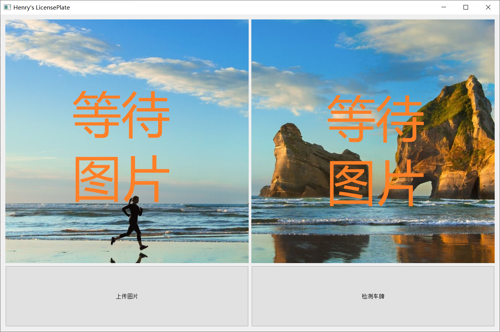
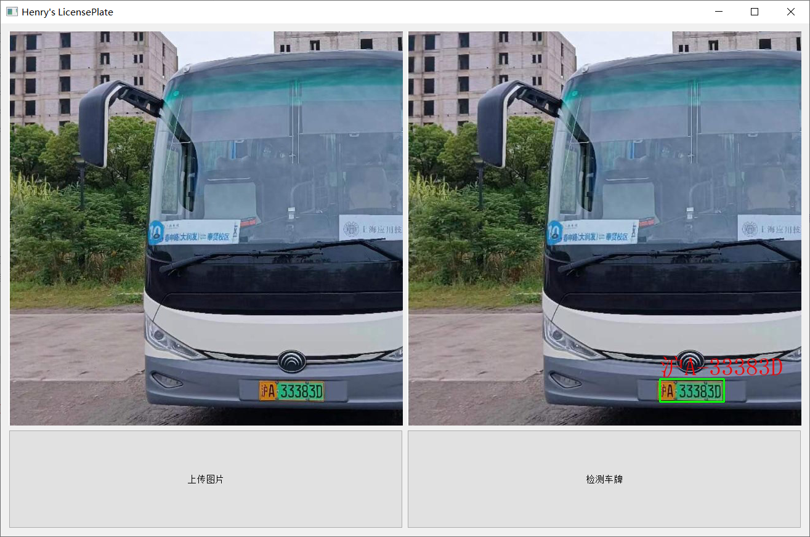

# LicensePlateDetection
Yolov5 and CRNN

### 简介

实训作业: 究极缝合怪

车牌定位: [YOLOv5](https://github.com/ultralytics/yolov5)  
数据集: [CCPD](https://github.com/detectRecog/CCPD)
[数据处理](https://github.com/lei1205/CCPD2YOLO)

车牌检测: [CRNN](https://github.com/Holmeyoung/crnn-pytorch)  
车牌数据集: [CBLPRD](https://github.com/SunlifeV/CBLPRD-330k)

yolov5模型: 链接：https://pan.baidu.com/s/1Z4MB-2A5I38iOmt6ZWgdkw?pwd=9rvk 
提取码：9rvk

crnn模型: 链接：https://pan.baidu.com/s/1rznVG0h6oLjQynCEug9YwA?pwd=qlqe 
提取码：qlqe

### 预览

  

